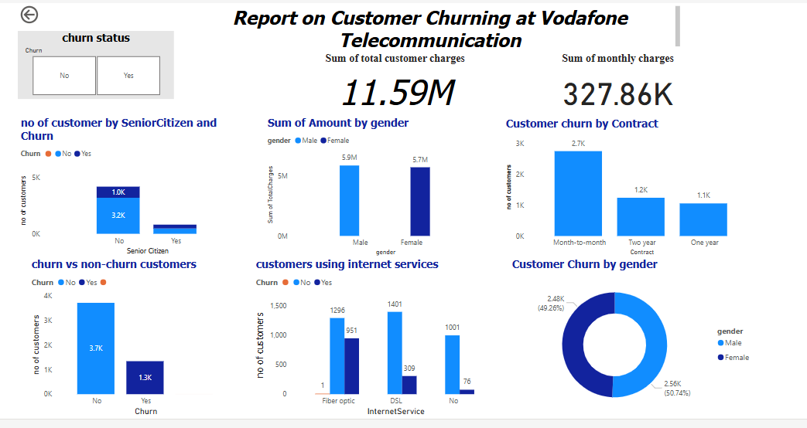

# CUSTOMER-CHUN-PREDICTION-AT-VODAFONE-CORPORATION

###  Business Understanding
### *Problem Statement*:
In a highly competitive market, businesses strive to retain their existing customers while continuously acquiring new ones. Customer churn, the phenomenon where customers stop doing business with a company, poses a significant threat to revenue and growth. Understanding and predicting customer churn can enable businesses to implement proactive measures to improve customer retention, thereby enhancing profitability and long-term customer loyalty.

### *Business Objectives*
- Predict Customer Churn: Develop machine learning models to accurately predict the likelihood of a customer leaving Vodafone.
- Identify Key Indicators: Determine the primary factors that contribute to customer churn.
- Develop Retention Strategies: Formulate effective strategies to retain customers based on the insights gained from the churn prediction models.
### *Stakeholders*
- Azubi Africa
- Azubi Learners
- Azubi CTA

### *Business Questons*
- what is the proportion of cusotmers who have churned to those who have not 
- Are senior citizens more likely to churn compared to younger customers?
- How do churn rates vary between customers using DSL, Fiber Optic, or no internet service?
- Are customers with longer tenure have less likelihood of churning
-  Is there any pattern in customer churn based on gender?
### *Hypothesis Statement*
- Null Hypothesis (Ho):There is a no significant relationship between the total amount charged to a customer and their likelihood of churning.
 - Alternative Hypothesis (H1):- There is a significant relationship between the total amount charged to a customer and their likelihood of churning.

 ### *Business Successs Criteria*
 - Accuracy: The model should achieve an overall accuracy of at least 85%. This ensures that the majority of predictions (both churn and non-churn) are correct.
- Precision and Recall: The model should maintain a precision and recall of at least 80%. High precision ensures that when the model predicts churn, it is usually correct. High recall ensures that the model identifies most of the actual churn cases.
- F1-Score: The F1-Score, which balances precision and recall, should be at least 0.80. This is crucial for ensuring that the model performs well in identifying churners without being biased towards either false positives or false negatives.
- AUC-ROC: The Area Under the Receiver Operating Characteristic Curve (AUC-ROC) should be at least 0.85. A high AUC-ROC value indicates a good ability to distinguish between churners and non-churners.
### *Data Understanding*
The data for this project are  in three different locations.The first two dataset will be used for training and evaluation of the models while the last dataset will be used for testing. The following describes the columns present in the data.

- Gender -- Whether the customer is a male or a female

- SeniorCitizen -- Whether a customer is a senior citizen or not

- Partner -- Whether the customer has a partner or not (Yes, No)

- Dependents -- Whether the customer has dependents or not (Yes, No)

- Tenure -- Number of months the customer has stayed with the company

- Phone Service -- Whether the customer has a phone service or not (Yes, No)

- MultipleLines -- Whether the customer has multiple lines or not

- InternetService -- Customer's internet service provider (DSL, Fiber Optic, No)

- OnlineSecurity -- Whether the customer has online security or not (Yes, No, No Internet)

- OnlineBackup -- Whether the customer has online backup or not (Yes, No, No Internet)

- DeviceProtection -- Whether the customer has device protection or not (Yes, No, No internet service)

- TechSupport -- Whether the customer has tech support or not (Yes, No, No internet)

- StreamingTV -- Whether the customer has streaming TV or not (Yes, No, No internet service)

- StreamingMovies -- Whether the customer has streaming movies or not (Yes, No, No Internet service)

- Contract -- The contract term of the customer (Month-to-Month, One year, Two year)

- PaperlessBilling -- Whether the customer has paperless billing or not (Yes, No)

- Payment Method -- The customer's payment method (Electronic check, mailed check, Bank transfer(automatic), Credit card(automatic))

- MonthlyCharges -- The amount charged to the customer monthly

- TotalCharges -- The total amount charged to the customer

- Churn -- Whether the customer churned or not (Yes or No)

